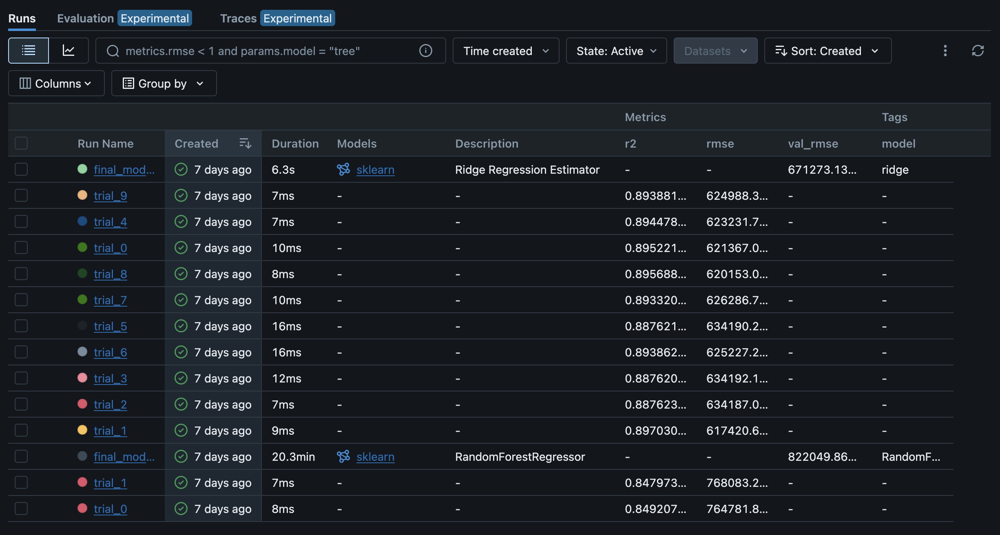
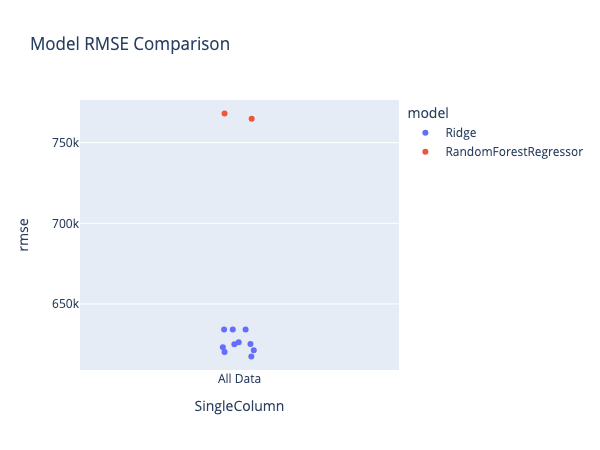
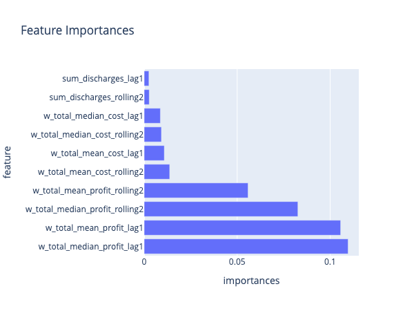

[](https://github.com/kletobias/advanced-mlops-lifecycle-hydra-mlflow-optuna-dvc/actions/workflows/ci.yaml)
[](https://www.terraform.io/)
[](https://mlflow.org)
[](https://optuna.org)
[](https://github.com/facebookresearch/hydra)
[](https://dvc.org)
[](https://prefect.io)


# Medical DRG in NY — A Reproducible ML & IaC Pipeline

Config-driven analytics on New York State DRG data with **Hydra**, **DVC**, **MLflow**, **Optuna**, and **Terraform-provisioned AWS infrastructure**. The project showcases senior-level MLOps patterns: modular transformations, data lineage, hyper-parameter search, IaC, and CI/CD automation.

## Spotlight Series & Deep-Dive Articles

Links to every Spotlight post and deep-dive project note on each MLOps pipeline component—DVC, feature engineering, hyperparameter tuning, logging, MLflow, modular code, Jinja2 templates, and transformations.

### Articles

- [Spotlight The Power of a Single dvc.yaml in MLOps](https://deep-learning-mastery.com/blog/2025/spotlight-the-power-of-a-single-dvcyaml-in-mlops/)
- [Spotlight Feature Engineering for Reproducibility and Scalability](https://deep-learning-mastery.com/blog/2025/spotlight-feature-engineering-for-reproducibility-and-scalability/)
- [Spotlight Hyperparameter Tuning with Hydra, Optuna, and MLflow](https://deep-learning-mastery.com/blog/2025/spotlight-hyperparameter-tuning-with-hydra-optuna-and-mlflow/)
- [Spotlight Logging for MLOps Consistency](https://deep-learning-mastery.com/blog/2025/spotlight-logging-for-mlops-consistency/)
- [Spotlight MLflow Integration](https://deep-learning-mastery.com/blog/2025/spotlight-mlflow-integration/)
- [Spotlight Modular Code as a Cornerstone of MLOps](https://deep-learning-mastery.com/blog/2025/spotlight-modular-code-as-a-cornerstone-of-mlops/)
- [Spotlight Jinja2 Templates for Efficient Pipeline Generation](https://deep-learning-mastery.com/blog/2025/spotlight-jinja2-templates-for-efficient-pipeline-generation/)
- [Spotlight Modular Transformations](https://deep-learning-mastery.com/blog/2025/spotlight-modular-transformations/)
- [Exploring dvc.yaml The Engine of a Reproducible Pipeline](https://deep-learning-mastery.com/projects/exploring-dvcyaml-the-engine-of-a-reproducible-pipeline/)
- [A Comprehensive Look at Feature Engineering in a Modular MLOps Pipeline](https://deep-learning-mastery.com/projects/a-comprehensive-look-at-feature-engineering-in-a-modular-mlops-pipeline/)
- [A Comprehensive Look at Hyperparameter Tuning with Hydra and Optuna in an MLOps Pipeline](https://deep-learning-mastery.com/projects/a-comprehensive-look-at-hyperparameter-tuning-with-hydra-and-optuna-in-an-mlops-pipeline/)
- [A Comprehensive Look at Logging in a Modular MLOps Pipeline](https://deep-learning-mastery.com/projects/a-comprehensive-look-at-logging-in-a-modular-mlops-pipeline/)
- [The Integration Of MLflow In This Project](https://deep-learning-mastery.com/projects/the-integration-of-mlflow-in-this-project/)
- [A Comprehensive Look at Modular Code in an MLOps Pipeline](https://deep-learning-mastery.com/projects/a-comprehensive-look-at-modular-code-in-an-mlops-pipeline/)
- [Automating DVC Pipelines with Jinja2 Templates](https://deep-learning-mastery.com/projects/automating-dvc-pipelines-with-jinja2-templates/)
- [Transformations as the Backbone of a Modular MLOps Pipeline](https://deep-learning-mastery.com/projects/transformations-as-the-backbone-of-a-modular-mlops-pipeline/)

### Videos

- [Transformations as the Backbone of a Modular MLOps Pipeline](https://youtu.be/puqy0Cw0TcI)
- [A Comprehensive Look at Hyperparameter Tuning with Hydra and Optuna in an MLOps Pipeline](https://youtu.be/enACoOgCxBs)
- [Automating DVC Pipelines with Jinja2 Templates](https://youtu.be/LpklKS1aXkw)
- [A Comprehensive Look at Modular Code in an MLOps Pipeline](https://youtu.be/lGIJrzQ3-q8)
- [The Integration Of MLflow In This Project](https://youtu.be/M1WEOWW_9CM)
- [A Comprehensive Look at Logging in a Modular MLOps Pipeline](https://youtu.be/nDq3mY0Ap7o)
- [A Comprehensive Look at Feature Engineering in a Modular MLOps Pipeline](https://youtu.be/zWC_Y7ei0kk)
- [Exploring dvc.yaml The Engine of a Reproducible Pipeline](https://youtu.be/gVPG-DZkI2M)

> **Note**: This repo is primarily a _portfolio project_. The pipeline is mostly reproducible, but may require a few **manual adjustments** to run end-to-end on your machine (explained below). If you just want to inspect the pipeline structure and ML artifacts, you can do so without running the entire pipeline locally.

---

## Dataset

- **Name**: 2010 New York State Hospital Inpatient Discharge Data  
- **Info (Kaggle)**: [2010 New York State Hospital Inpatient Discharge Data](https://www.kaggle.com/datasets/thedevastator/2010-new-york-state-hospital-inpatient-discharge)  
- **Source**: [data.world](https://data.world/healthdatany) (requires login)

## Key Features

- **Hydra Configuration** – parameters live outside the codebase.  
- **Data Versioning with DVC**  
- **Experiment Tracking with MLflow**  
- **Modular Transformations**  
- **Infrastructure-as-Code (Terraform)** – S3 buckets, IAM OIDC role, optional GPU runner are provisioned repeatably.  
- **CI/CD via GitHub Actions**  
- **Metadata Logging**

---

## Tests & Validation

This project supports data validation through Pandera-based checks.  
The `universal_step.py` script automatically runs tests whenever the relevant test flags (e.g., `check_required_columns`, `check_row_count`) are set to `True` in `configs/transformations/`.  

**How it Works**  
- **Test Definitions**: Located in `dependencies/tests/check_required_columns.py` and `dependencies/tests/check_row_count.py`.  
- **Test Config**: Global YAML configs in `configs/tests/base.yaml` specify the required columns and expected row counts (these can be overridden in `configs/test_params/`).  
- **Automatic Execution**: Once a transformation step completes, the script checks if any test flags are `True`. If so, it calls the corresponding test function with the parameters from `cfg.tests`.  
- **Failure Handling**: Any mismatch or missing column triggers a Pandera `SchemaError`, halting the pipeline.

**Example**  
To enable the column and row-count checks, set:
```yaml
transformations:
check_required_columns: true
check_row_count: true
tests:
check_required_columns:
  required_columns: ["year", "facility_id", "apr_drg_code"]
check_row_count:
  row_count: 1081672
```

This ensures the pipeline data is consistent and trustworthy throughout each processing stage.

## Infrastructure (IaC via Terraform)

```text
infra/
├── main.tf              # root module – backend & providers
├── modules/
│   ├── s3_data/         # DVC remote bucket
│   ├── s3_mlflow/       # MLflow artifacts bucket
│   ├── iam_github_oidc/ # federated role for CI
│   └── gpu_runner/      # optional self-hosted GPU runner
└── environments/
  ├── dev.tfvars
  └── prod.tfvars
```

**Bootstrap**

```bash
cd infra
terraform init
terraform apply -var-file=environments/dev.tfvars
```

All resources are tagged `mlops-ny-drg` and can be removed with `terraform destroy`.

CI jobs assume `GithubOIDCRole`, pull data from `s3://ghcicd`, and push MLflow artifacts.

---

## Continuous Integration (GitHub Actions)

| Job               | Trigger                          | Python | Key steps                                    |
|-------------------|----------------------------------|--------|----------------------------------------------|
| **quick-quality** | every push / PR                  | 3.12   | linters, mypy, pre-commit, DVC pull          |
| **full-quality**  | weekly cron (Sat 04 UTC)         | 3.10/3.11 | same as above (matrix)                       |
| **gpu-pipeline**  | cron, manual, or commit with `[gpu]` | 3.12   | `dvc repro -P` on GPU runner, push artifacts |

All jobs cache pip wheels, reuse the same AWS OIDC role, and upload artifacts for inspection.

---

## Repository Structure

```text
.
├── infra/                  # Terraform IaC (see above)
├── .github/workflows/      # ci.yaml – quality + GPU jobs
├── configs/                # Hydra configs
│   ├── config.yaml
│   ├── data_versions/
│   ├── pipeline/
│   └── transformations/
├── data/                   # DVC-tracked
├── dependencies/           # transformations/, modeling/
├── scripts/                # universal_step.py, orchestrate_dvc_flow.py
├── logs/
├── dvc.yaml
└── ...
```

### Additional Docs

- See [documentation/detailed_documentation.md](documentation/detailed_documentation.md) for a deeper dive.  
- Hydra: [docs](https://hydra.cc/docs/intro/)  
- DVC: [docs](https://dvc.org/doc)  
- MLflow: [docs](https://mlflow.org/docs/latest)

---

### MLflow Outputs

Although only two random forest trials are shown in the final run, we had previously tested random forest extensively. We limited it to two in the final pipeline because it is more time-consuming, but these results remain representative of the model’s performance from the broader experiments.

The R² for ridge regressions is usually between 0.86 and 0.89, while for the random forest regressor it tends to fall between 0.84 and 0.86.

Our target column is `w_total_median_profit`. See:

- Transformation: [agg_severities.py](dependencies/transformations/agg_severities.py)  
- Associated Config: [agg_severities.yaml](configs/transformations/agg_severities.yaml)







## Check the Logs

A complete pipeline log from running `scripts/orchestrate_dvc_flow.py` is available in the `logs/pipeline` directory: [pipeline log directory](logs/pipeline).

Hydra logs from the same execution, with one file per transformation, are located in `logs/runs`: [runs logs directory](logs/runs/).

---

## Installation & Basic Setup

> **Disclaimer**: The instructions below assume you’re familiar with DVC, Hydra, and basic Python package management. Because this is a portfolio repo, you may need to tweak some paths in `configs/` or environment variables to get everything running on your setup.

### 1. Create & Activate a Python Environment

```bash
conda env create -f env.yaml
conda activate ny
```

or

```bash
micromamba env create -f env.yaml
micromamba activate ny
```

### 2. (Optional) Set Environment Variables

Some Hydra configs reference environment variables like `$CMD_PYTHON` or `$PROJECT_ROOT`. Define them manually or via a .env file:

```bash
export CMD_PYTHON=/path/to/your/conda/envs/ny/bin/python
export PROJECT_ROOT=/path/to/this/repo
```

### 3. Pull Data & Artifacts from S3 (Optional)

```bash
python dependencies/io/pull_dvc_s3.py
```

This configures the DVC remote (public S3) and pulls data into `data/`.

```bash
python dependencies/io/pull_mlruns_s3.py
```

This populates the `mlruns/` folder with finalized experiments.

### 4. Check or Adjust dvc.yaml

If you find path mismatches, edit commands in `dvc.yaml` or override Hydra values on the CLI.

---

## Running the Pipeline

### 1. Force Reproduce All Stages

```bash
dvc repro --force -P
```

### 2. Run a Single Stage

```bash
dvc repro --force -s v10_lag_columns
```

### 3. Check the Logs

Logs live in `logs/runs/${timestamp}` with one file per step.

---

## Known Caveats

1. **Manual Pipeline Config Adjustments** – export required env vars or update paths.  
2. **Mixed Git/DVC Tracking** – see [data/](data/).  
3. **S3 Accessibility** – all datasets and artifacts live in a public S3 bucket.

---

## Why This Setup?

1. Config-Driven & Modular  
2. Version-Controlled & Reproducible  
3. IaC for repeatable cloud resources  
4. CI guarantees style, type-safety, reproducibility  
5. MLflow experiment management

---

## Contact

Tobias Klein — open an issue or DM on [LinkedIn](https://www.linkedin.com/in/deep-learning-mastery/).

© 2025 Tobias Klein. All rights reserved. This repository is provided for demonstration and personal review. No license is granted for commercial or non-commercial use, copying, modification, or distribution without explicit, written permission.
